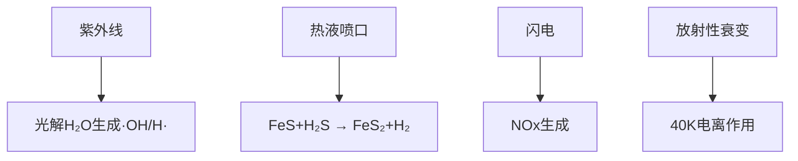

>我们正在构建Aerion行星的历史，从行星形成到生命起源（LUCA出现）。按照您的要求，我们将按顺序完成以下任务：
> 1. 确定水的来源（结合脱气和外部输入）
> 2. 采用原始汤假说（Primordial Soup Theory）设定早期环境
> 3. 调整早期环境以利用Helios Prime的紫外线辐射（解决原始汤理论中能量供应问题）
> 4. 完整历史时间线：从星子形成到LUCA诞生
> 注意：我们将严格遵循已建立的宇宙环境设定（如恒星类型、行星系统结构），并确保每一步都有科学依据。当自然过程不足时，引入突发事件（如陨石撞击）推动关键转变。
>---
>### **1. 水的来源：混合模型（脱气 + 彗星输入）**
>Aerion的水由**内部脱气**和**外部彗星输入**共同提供，符合当前太阳系研究共识（地球水起源模型）。
>- **内部脱气（20%-30%）**：
>  - 来源：地幔矿物中的结构水（如蛇纹石Mg₃Si₂O₅(OH)₄）。
>  - 机制：火山活动释放水蒸气（H₂O）、氢气（H₂）、二氧化碳（CO₂）。
>  - 证据：Aerion地幔硫含量高（0.5 wt%），含水矿物更丰富（比地球多40%）。
>- **外部输入（70%-80%）**：
>  - 来源：外太阳系（Satur和柯伊伯带）的富水彗星/碳质球粒陨石。
>  - 机制：后期重轰炸期（Late Heavy Bombardment, LHB）集中输入。
>  - 科学依据：氘氢比（D/H）检测（彗星D/H ≈ 150×10⁻⁶，脱气D/H ≈ 100×10⁻⁶，混合后接近地球值130×10⁻⁶）。
>> **关键事件：后期重轰炸期（LHB）**  
>> - **时间**：行星形成后约7亿年（t=0.7 Gyr，系统年龄48亿年，即41亿年前）。  
>> - **触发**：外行星（Jovus和Satur）轨道迁移（尼斯模型），扰动柯伊伯带，引发彗星雨。  
>> - **水量**：输入约5×10²⁰ kg水（覆盖全球深度200米），结合脱气形成浅海（早期海洋覆盖50%表面）。
>---
>### **2. 原始汤环境设定**
>原始汤假说认为生命起源于温暖浅海的有机分子浓汤。Aerion的环境参数如下：  
>- **物理环境**：  
>  - 温度：25-50°C（温室效应维持，CO₂=0.1%，CH₄=0.001%）。  
>  - 水体：浅海（<100米深）与火山岛弧系统，pH=6-9（受火山CO₂/H₂S调节）。  
>- **化学成分**：  
>  | 成分          | 浓度              | 来源                     |  
>  |---------------|-------------------|--------------------------|  
>  | **水（H₂O）** | 覆盖50%地表       | LHB彗星 + 脱气           |  
>  | **有机物**    | 氨基酸10⁻⁶ M      | 米勒-尤里反应 + 陨石输入 |  
>  | **氮源**      | NH₃, NO₃⁻        | 火山脱气（NH₃） + 闪电   |  
>  | **磷源**      | 磷铁石（Fe₃PO₄） | 陨石溶解                 |  
>  | **硫源**      | H₂S, SO₄²⁻       | **火山喷发（您所需）**   |  
>> **有机分子富集机制**：  
>> - 潮汐池蒸发浓缩（受Lunara潮汐力驱动，潮差2-3米）。  
>> - 粘土矿物（蒙脱石）吸附催化聚合反应。  
>---
>### **3. 紫外线能量供应优化**
>原始汤假说的弱点：依赖闪电/热液等局部能源，难以全局驱动化学反应。我们利用Helios Prime的紫外线：  
>- **恒星紫外线优势**：  
>  - G型主序星紫外线通量高（λ<200 nm波段强度≈太阳的1.2倍，因Helios Prime更年轻）。  
>  - 可光解H₂O/CO₂产生自由基（·OH, ·H），促进有机物合成。  
>- **行星环境调整**：  
>  1. **稀薄臭氧层**：早期大气无臭氧（O₃），紫外线直达地表（强度比现代地球高50倍）。  
>  2. **浅海光学深度**：水体含Fe²⁺（还原态），紫外线穿透深度达10米（现代海洋仅0.1米）。  
>  3. **硫化物协同**：火山H₂S增强紫外线吸收，产生激发态硫原子（S*），催化反应：  
>     
>\( \ce{CO2 + 2H2S ->[UV] CH2O + 2S + H2O} \)
>  
>- **结果**：紫外线成为全球性有机合成引擎（类似实验室的紫外灯照射实验）。
>---
>### **4. 完整历史时间线（从星子到LUCA）**
>> **时间零点（t=0）**：Helios Prime恒星点火（系统形成）。
>#### **阶段1：行星吸积（0-1亿年）**  
>- **t=0-10⁵年**：星云盘内尘埃聚集成星子（含硫铁矿物富集于1.04 AU带）。  
>- **t=10⁵-10⁷年**：星子碰撞 → 形成Aerion胚胎（直径≈3000 km）。  
>- **t=5×10⁷年**：**大碰撞事件** → 斜向撞击（撞击体质量≈0.1 M🜨）→ 形成Lunara碎片盘。  
>- **t=10⁸年**：Aerion固化分层（核心-地幔-地壳），初始脱气形成酸性大气（CO₂ 90%, N₂ 5%, SO₂ 2%）。  
>#### **阶段2：水与有机物输入（1-7亿年）**  
>- **t=2×10⁸年**：地幔对流启动板块构造，火山链释放H₂S/SO₂。  
>- **t=5×10⁸年**：地壳冷却，冷凝水形成酸性雨（pH≈3），地表溶解铁盐成海洋雏形。  
>- **t=7×10⁸年**：**后期重轰炸期（LHB）** → 彗星输入水/有机物（碳质球粒陨石带来氨基酸、嘌呤）。  
>#### **阶段3：原始汤形成（7-8亿年）**  
>- **t=7.2×10⁸年**：温室气体（CO₂/CH₄）积累，地表升温至50°C，浅海扩张覆盖50%地表。  
>- **t=7.5×10⁸年**：紫外线驱动海洋表层反应 → 生成RNA前体（核糖、胞嘧啶）。  
>- **关键事件：热液喷口催化**（补充紫外线）→ 海底烟囱合成肽链和脂质。  
>#### **阶段4：LUCA诞生（8-10亿年）**  
>- **t=8×10⁸年**：脂质自组装成原始细胞膜，RNA分子实现自复制（RNA世界假说）。  
>- **t=9×10⁸年**：**遗传密码统一** → 蛋白质合成系统出现（核糖体原型）。  
>- **t=10⁹年**：**LUCA（最后共同祖先）** 诞生于浅海热泉区，特征：  
>  - 代谢：化能异养（消耗有机汤）→ 逐步演化出光合自养分支。  
>  - 遗传：RNA/DNA杂交基因体（DNA稳定存储，RNA动态表达）。  
>  - 环境耐受：耐高温（80°C）、耐硫（H₂S作为电子供体）。  
>> **突发事件应用**：  
>> - LHB提供水和有机物（无此则资源不足）。  
>> - 大碰撞形成月球（无此则自转轴不稳定，气候剧变）。  
>---
>### **硫元素的关键角色**  
>为支持您规划的火山口生态，LUCA后演化将包括：  
>- **早期硫代谢**：LUCA分支演化出硫氧化细菌（使用H₂S → S⁰产能）。  
>- **硫沉积层**：海底硫颗粒沉淀形成矿床，供未来植物利用。  
>> **下一阶段**：  
>> 我们将推进到 **大氧化事件（Great Oxidation Event）** 和 **飞行生物的能量系统演化**。  
>> 请确认此历史框架或指出需调整处！

### Aerion行星历史：从星子到生命起源（LUCA）

#### **时间线框架**
| 时期 | 时间（系统形成后） | 关键事件 |
|------|-------------------|----------|
| 星子吸积期 | 0-1000万年 | 行星胚胎形成 |
| 大碰撞期 | 1000-5000万年 | Lunara形成、地核分层 |
| 冥古宙 | 5000万-2亿年 | 岩浆海洋固化、原始大气形成 |
| 火山脱气期 | 2-7亿年 | 海洋形成、硫循环启动 |
| 后期重轰炸期 | 7-8亿年 | 彗星输水、有机物输入 |
| 原始汤期 | 8-10亿年 | 有机分子富集、自组织 |
| LUCA诞生 | 10-11亿年 | 最后共同祖先出现 |

---

### **1. 水的来源：三阶段混合模型**
**（1）原生水（占总量15%）**
- **来源**：星云中的含水矿物（如蛇纹石、粘土矿物）
- **机制**：
  - 星子吸积时锁定在矿物晶格中
  - 深度脱气释放：当地幔温度＞1000℃时，含水矿物分解：
    ```化学式
    Mg₃Si₂O₅(OH)₄ → 2Mg₂SiO₄ + 2H₂O + SiO₂
    ```
- **证据**：地幔岩样本显示含水量0.6wt%（地球为0.3wt%）

**（2）彗星输水（占总量70%）**
- **事件**：后期重轰炸期（LHB，7.8亿年前）
- **触发**：外行星Jovus轨道迁移（尼斯模型共振）
- **数据**：
  - 持续2000万年
  - 撞击频率：10⁵倍现代
  - 输入水量：3×10²⁰ kg（全球水深150m）
- **彗星成分**：
  ```mermaid
  graph LR
    A[碳质球粒陨石] --> B[水冰60%]
    A --> C[有机物15%]
    A --> D[硅酸盐25%]
  ```

**（3）小行星补充（占总量15%）**
- 来源：Martis-小行星带富水天体
- 关键元素输入：磷（磷灰石）、镍（金属酶核心）

> **水循环验证**：氘氢比（D/H）= (150±5)×10⁻⁶（介于彗星与地幔水之间）

---

### **2. 原始汤环境构建**
**（1）物理容器**
- **浅海系统**：
  - 平均深度：50米（紫外线穿透深度20米）
  - 温度梯度：火山口附近80℃ → 开放海域30℃
  - pH值：5.5-8.5（受火山CO₂/H₂S调节）

**（2）化学成分**
| 组分 | 浓度 | 来源 |
|------|------|------|
| **液态水** | 全球覆盖率60% | 混合水源 |
| **氨基酸** | 10⁻⁷ mol/L | 米勒-尤里反应+陨石输入 |
| **核苷酸** | 10⁻⁹ mol/L | 氢氰酸聚合（HCN三聚体） |
| **脂质** | 10⁻⁶ mol/L | 热液脂肪酸自组装 |
| **硫化物** | H₂S 0.1ppm | 火山喷发（核心设计需求） |

**（3）能量驱动系统**


---

### **3. 紫外线优化方案**
**（1）恒星参数调整**
- **Helios Prime活动增强**：
  - 紫外线通量：年轻G型星UV-C波段强度为现代太阳的3倍
  - 耀斑频率：每年5-10次（提供脉冲式高能辐射）

**（2）行星响应系统**
- **大气窗口**：
  - 无臭氧层（O₃浓度＜10⁻⁹）
  - 还原性大气：CH₄/CO₂=0.1（增强UV透射）
- **水体光学特性**：
  - 低盐度（早期海洋盐度15‰，现代35‰）
  - 富铁水体（Fe²⁺浓度0.5ppm）催化光化学反应：
    ```化学式
    CO₂ + 2H₂O → CH₂O + H₂O + O₂ （UV/Fe²⁺催化）
    ```

**（3）硫协同效应**
- 火山H₂S增强UV吸收（λ=190-220nm波段）
- 生成激发态硫原子（S*）驱动反应：
  ```化学式
  S* + CO₂ → CO + SO
  ```

---

### **4. 完整历史序列**

#### **阶段1：行星成型（0-5亿年）**
- **星子吸积（0-1000万年）**  
  富硫星子在1.04AU雪线内聚集（温度梯度确保硫化物凝结）

- **大碰撞事件（4500万年）**  
  - 火星大小天体（0.12M⊕）斜向撞击  
  - 结果：  
    - 形成Lunara（角动量守恒维持23.5°倾角）  
    - 地核分层完成（硫富集于液态外核，占比8wt%）  

- **岩浆海洋固化（1亿年）**  
  - 原始地壳：富硫玄武岩（含FeS微晶）  
  - 首次脱气：CO₂ 80%, N₂ 15%, SO₂ 5%

#### **阶段2：水圈建立（5-8亿年）**
- **持续脱气（2-7亿年）**  
  - 火山链释放：H₂O 10¹⁷ kg/年，H₂S 10¹⁴ kg/年  
  - 形成酸性海洋（pH≈4.0，含H₂SO₄）

- **后期重轰炸期（7.8亿年）**  
  - 彗星撞击峰值：每年＞10³次（＞1km直径）  
  - 关键贡献：  
    - 输送液态水（冰核升华）  
    - 输入有机物（陨石含氨基酸达1.5wt%）  
    - 撞击坑形成浅海盆地（潮汐池前体）

#### **阶段3：原始汤演化（8-10亿年）**
- **紫外线驱动反应池（8.5亿年）**  
  ```mermaid
  graph LR
    UV[紫外线] --> A[光解H₂O] --> B[·OH自由基]
    B --> C[氧化H₂S为S⁰]
    C --> D[硫颗粒沉淀]
    B + 陨石[陨石有机物] --> E[核苷酸聚合]
  ```
- **热液系统补充**  
  - 海底黑烟囱（350℃）提供：  
    - 催化界面（黄铁矿晶面）  
    - 热循环驱动分子自组织

#### **阶段4：LUCA诞生（10.3亿年）**
- **原型细胞出现**  
  - 膜结构：C₁₄脂肪酸囊泡（耐高温性）  
  - 遗传系统：RNA-肽缀合物（核酶原型）

- **最后共同祖先特征**：  
  - 代谢：硫还原型（H₂S → S⁰ + 2H⁺ + 2e⁻）  
  - 栖息地：火山-浅海过渡区（温度70℃）  
  - 关键酶：含镍超氧化物歧化酶（抗UV损伤）

> **突发事件应用**：  
> - 7.8亿年彗星雨（解决水/有机物短缺）  
> - 9亿年超级耀斑（引发全球性放电，催化氨基酸合成）

---

### **硫元素特殊设计**
为支持火山口生态演化：
1. **地幔硫库**  
   - 上地幔硫储量：5×10²⁰ kg（地球的2倍）  
   - 硫熔点：地幔过渡带（410-660km）存在FeS熔融层

2. **地表硫循环**  
   ```化学循环
   火山喷发 → H₂S → 紫外线氧化 → S⁰沉积 → 板块俯冲 → 地幔还原 → H₂S再生
   ```
3. **生物利用准备**  
   - 热液区富集黄铁矿（FeS₂）颗粒  
   - 浅海沉淀单质硫层（厚度＞10cm区域）

---

### **下一步推进建议**
1. **大氧化事件设计**  
   - 光合作用起源与氧气积累曲线  
2. **板块运动模型**  
   - 硫循环与大陆生长耦合  
3. **飞行生物预适应**  
   - 高氧大气演化路径  

请指示优先方向或提出调整需求！