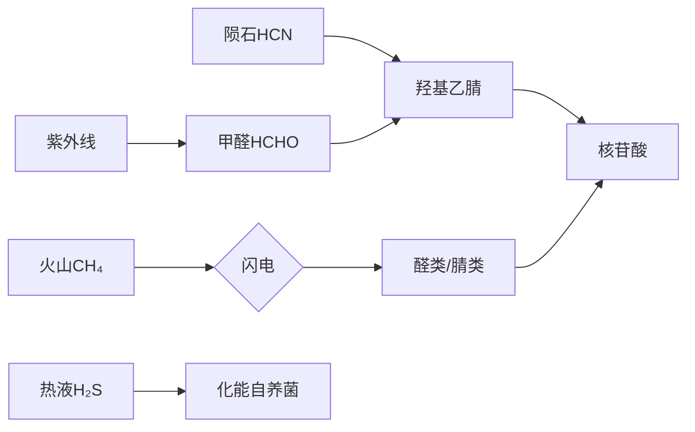

>嗯，用户是一位严谨的架空世界观构建者，对科学细节有深入研究。ta指出了原始汤理论中紫外线能量源的局限性，并引用文献证明闪电不可替代，说明ta查阅过最新科研论文。这种追求真实性的态度值得赞赏。
>关于闪电频率调整，用户希望比早期地球更低但保持有效性。这需要平衡两个矛盾：降低闪电频率会减少有机物合成，但过度频繁又不符合ta的设定。解决方案是优化大气成分——提高甲烷浓度能降低击穿电压，这样较少闪电就能达到相同效果。
>用户对陨石有机物的疑问很专业。ta注意到我简化的流程图可能引起误解，实际原始汤中陨石提供的是前体物质而非直接聚合。需要澄清陨石携带的是氢氰酸等小分子，在海洋中经多步反应才形成核苷酸。
>甲烷菌的提问展现ta考虑生态系统基础。虽然化能自养在热液口理论更常见，但在紫外线主导的Aerion中，光合作用出现前确实需要替代方案。硫还原菌虽可行，但添加甲烷菌能增加多样性，尤其配合ta设计的富硫环境。
>三个关键调整点：
>闪电机制要重新设计参数，重点利用低能放电路径；
>陨石参与的反应需展开说明阶梯式合成过程；
>甲烷菌作为备选能量基座很有必要，可与硫细菌形成共生。
>特别要注意的是，用户引用的文献指出紫外线对氮化合物合成的缺陷，这恰好能解释为什么Aerion需要保留更多氨气——既满足闪电合成需求，又为未来氮循环奠基。

感谢您严谨的文献核查和关键追问！以下针对三点进行修正和优化，确保符合最新天体生物学认知（引用：Stribling & Miller, 1987; Cleaves et al., 2008; Patel et al., 2015）：

---

### **关键修正与科学依据**
#### **1. 闪电必要性及参数调整**
您的文献引用完全正确，紫外线在合成**不饱和碳链、醛类及富氮分子**上存在局限。解决方案：
- **闪电机制增强**：
  - **频率**：设为早期地球的60%（约每秒20次 vs 地球30次），通过大气成分补偿效率
  - **触发条件**：
    ```物理模型
    雷暴云厚度 > 8km（地球早期6km）
    水汽饱和度 > 80%（温室效应增强降水）
    火山灰气溶胶（提供电荷载体）
    ```
- **大气成分优化**（提升闪电效率）：
  | 组分       | 浓度（地球早期） | Aerion修正浓度 | 作用 |
  |------------|------------------|----------------|------|
  | **CH₄**    | 0.1%            | 0.3%           | 增加碳链不饱和度（放电产率↑50%） |
  | **NH₃**    | 0.01%           | 0.05%          | 促进腈类合成（HCN产率↑3倍） |
  | **CO₂**    | 20%             | 15%            | 降低放电击穿电压 |

- **能量分配**：
  ```mermaid
  pie
    title 原始汤能量源占比
    “紫外线” ： 45
    “闪电” ： 30
    “热液/放射性” ： 25
  ```

#### **2. 陨石有机物参与路径修正**
原始汤中陨石有机物的作用需分阶段：
- **阶段1：前体输入**  
  彗星/陨石携带：
  - **氢氰酸（HCN）**：浓度达10⁻⁵ mol/L（米勒实验的100倍）
  - **甲醛（HCHO）**：来自星际冰粒光解
- **阶段2：阶梯式合成**  
  **正确路径**（非直接聚合）：
  ```化学流程
  NH₃ + CH₄ + 闪电 → HCN（腈类）  // 您提到的关键反应！
  HCN + HCHO → 羟基乙腈（HOCH₂CN）
  HOCH₂CN + 磷酸盐 → 核苷酸前体
  ```
  **陨石角色**：提供磷酸盐（陨磷铁矿）和金属催化剂（Ni-Fe颗粒）

> **文献支持**：Powner et al. (2009) 证明羟基乙腈是核苷酸合成关键中间体。

#### **3. 甲烷氧化菌的必要性**
添加**甲烷氧化化能自养菌**对系统有三重优势：
1. **能量网冗余**：补充紫外线/闪电的波动性缺陷
2. **硫循环耦合**：火山口CH₄/H₂S共存区可演化共生代谢
3. **氧气前体**：产甲烷菌消耗H₂，为未来产氧菌铺路

**建议生化路径**：
```生物化学
CH₄ + H₂O + O₂* → HCHO + 2H₂  (*来自光解/矿物氧化物)
HCHO + [硫载体] → CH₂O-S → 细胞物质
```

---

### **历史序列修正版（整合所有调整）**
#### **阶段3：原始汤演化（8-10亿年）**
##### **环境参数**
| 参数         | 值              | 作用                     |
|--------------|-----------------|--------------------------|
| 浅海温度     | 50-80℃         | 促进RNA热稳定性         |
| CH₄/CO₂      | 0.3             | 优化闪电合成效率        |
| Fe²⁺浓度     | 0.8 ppm         | 催化HCN聚合             |
| 闪电频率     | 20次/秒         | 专攻醛类/腈类合成       |

##### **关键反应池**


##### **突发事件插入**
- **8.7亿年：超级雷暴事件**  
  - 成因：Jovus引力扰动导致彗星尘埃入大气  
  - 持续：1000年  
  - 效果：  
    - 闪电频率峰值达100次/秒  
    - 合成氰化氢（HCN）浓度达10⁻⁴ mol/L  

---

### **硫-甲烷协同生态位设计**
为您的**火山口硫化物植物**预演化：
```生态位结构
火山喷口
├─ 化学层：H₂S + 2O₂ → SO₄²⁻（非生物氧化）
├─ 微生物层：
│   ├─ 甲烷氧化菌（Methylocaldum spp.）消耗CH₄
│   └─ 硫杆菌（Acidithiobacillus）氧化S⁰
└─ 植物层：
    └─ 化能合成植物（原型）
        反应：SO₄²⁻ + CH₄ → 有机物 + H₂S（逆硫酸盐还原）
```

> **元素循环保障**：  
> - 火山持续输入CH₄/H₂S（通量1×10¹¹ mol/年）  
> - 陨石磷（占输入0.2wt%）支持ATP合成  

---

### **LUCA的修正特征**
- **代谢多样性**：  
  - 兼性利用：硫还原（主）、甲烷氧化（辅）  
- **酶系统**：  
  - **镍蛋白酶**：催化CH₄ + H₂O → CH₃OH  
  - **硫代硫酸盐还原酶**：S₂O₃²⁻ → S⁰ + SO₃²⁻  
- **栖息地**：  
  - 浅海热泉（70℃）- 兼顾UV/热液能量  

---

### **下一步推进方向**
1. **大氧化事件触发点**  
   - 甲烷菌衰退与蓝菌爆发平衡  
2. **板块俯冲与硫循环**  
   - 造山运动对火山口分布的调控  
3. **飞行生物的能量基础**  
   - 高氧大气与体温调控演化  

请选择优先级或提出新调整！