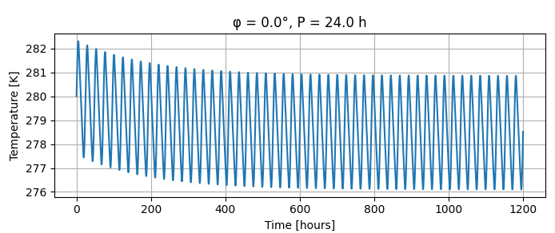

1. - **目标**：计算无轴倾角的有自转的行星上一点的温度变化。
2. - **已知公式与参数定义**: 
        - 球体面积公式：$S=4\pi R^2$。R为半径。
        - 斯特藩-玻尔兹曼定律：$P_{\text{net}} = \varepsilon \sigma A_{表面积} (T^4 - T_{\text{env}}^4)$。$\varepsilon$为发射率，σ为斯特藩-玻尔兹曼常数，$A_{表面积}$为表面积，T为温度，$T_{env}$为环境温度。
        - 热传递公式： $cmΔt=Q$，其中c为比热容，m为质量，Δt为温度变化，Q为热量。
        - P为自转周期，A为行星反照率，C为单位面积热容，φ为纬度。
3. **正文**
    - **step1**
        - **规划框架**
            - 首先已知辐射始终为 $f_{热辐射}(T)=\varepsilon \sigma A (T^4 - T_{\text{env}}^4) $，其次需要计算日间接收到的辐射，然后计算夜间辐射的热量，构建出总热量对应的方程，这个方程将与时间t和纬度φ有关。即：$$f_{能量}(t,φ)=f_{日间能量变化}(t,φ)-f_{夜间能量辐射}(t)$$
            又可细化为：$$f_{能量}(t,φ)=f_{日间能量吸收}(t,φ)+f_{夜间能量吸收}(t)-f_{日间能量辐射}(t,φ)-f_{夜间能量辐射}(t)$$
    - **step2**
        - **计算日间能量变化**
            - 忽略水平热传递，计算行星上单独一点白天吸收的能量：$$f_{日间能量变化}(t,φ)=(1-A)S \cdot \cos(φ) \cdot \cos(ωt)$$ 其中S为太阳常数，即垂直于太阳光线的单位面积，单位时间接收的太阳辐射能量，$ω=2 \pi / P$。
            - 计算日间辐射能量：$$f_{日间能量辐射}(t) = \varepsilon \sigma (T^4 - T_{\text{env}}^4)$$
            - 所以：$$f_{日间能量变化}(t,φ)=(1-A)S \cdot \cos(φ) \cdot \cos(ωt)-\varepsilon \sigma (T^4 - T_{\text{env}}^4)$$
        - **计算夜间能量变化**
            - 由于夜间只有辐射，所以：$$f_{夜间能量辐射}(t)=\varepsilon \sigma (T^4 - T_{\text{env}}^4)$$ $$f_{夜间能量吸收}(t)=0$$
        - **列出微分方程**
            - 日间：$$C \frac{dT}{dt}=(1-A)S \cdot \cos(φ) \cdot \cos(ωt)-\varepsilon \sigma (T^4 - T_{\text{env}}^4)$$
            - 夜间：$$C \frac{dT}{dt}=\varepsilon \sigma (T^4 - T_{\text{env}}^4)$$
    - **step3**
        - **查阅相关参数**
            - 单位面积热容可通过公式：$$ C = \rho c_{\!p}\,H$$计算，其中ρ为密度，$c_{\!p}$为比热容，H为厚度（单位m）。
            - 参考地球数据，不考虑海洋的地壳平均密度为：${2,830 kg/m^3}^{[1]}$，平均比热容为$1000 J/(kg·K)^{[2]}$。所以：$$ C = 2,830 \times 1000 \times H = 283,000H J/m^2/K$$
            - 太阳常数S可通过公式：$$ S = \frac{L}{4\pi R^2} $$计算，其中L为恒星的光度，R为行星轨道平均半径。
            - 地球发射率为0.83，宇宙背景温度约为2.7K。
    - **step4**
        - **求解微分方程**
            - 由于这两个微分方程解析解复杂，所以使用基于py的数值求解方法。代码由ai kimi编写：
            ```python
            """
            无大气、无轴倾角、有自转行星上一点的温度变化。
            微分方程：
                白天：  C dT/dt = (1-A) S cosφ cos(ωt)  –  ε σ (T⁴ – T_env⁴)
                夜间：  C dT/dt = – ε σ (T⁴ – T_env⁴)
            支持任意自转周期 P、任意纬度 φ、任意模拟时长。
            """

            import numpy as np
            from scipy.integrate import solve_ivp
            import matplotlib.pyplot as plt

            # ------------------ 物理参数（SI 单位） ------------------
            # 行星
            R     = 6.371e6     # 行星半径 [m]（仅用于展示，不影响计算）
            A     = 0.28         # 反照率
            P     = 24*3600     # 自转周期 [s]   <-- 可任意改
            φ     = np.deg2rad(0)  # 纬度 [rad]   <-- 可任意改
            C     = 2.83e6       # 单位面积热容 [J m⁻² K⁻¹]

            # 辐射
            ε     = 0.83
            σ     = 5.670e-8
            T_env = 3.0         # 深空温度 [K]

            # 太阳常数
            S     = 1235.0      # [W m⁻²]

            # ------------------ 辅助量 ------------------
            ω      = 2*np.pi / P
            cosφ   = np.cos(φ)

            # ------------------ 微分方程右侧 ------------------
            def rhs(t, T):
                """
                统一右端函数，内部根据 cos(ωt) 符号判断白天/夜间
                """
                rad_term = ε * σ * (T**4 - T_env**4)
                solar_flux = (1 - A) * S * cosφ * np.cos(ω*t)
                # 夜间 cos(ωt)<=0 时太阳项置零
                solar_flux = np.maximum(solar_flux, 0.0)
                return (solar_flux - rad_term) / C

            # ------------------ 事件函数：记录日出/日落 ------------------
            def sunrise(t, T):
                return np.cos(ω*t)

            sunrise.terminal   = False
            sunrise.direction  = 1   # 由负到正（日出）

            def sunset(t, T):
                return np.cos(ω*t)

            sunset.terminal    = False
            sunset.direction   = -1  # 由正到负（日落）

            # ------------------ 主积分 ------------------
            t0      = 0.0
            T0      = 270.0         # 初始温度 [K]
            t_end   = 50*P           # 模拟总时长（可任意改）
            dt_out  = 300.0         # 输出间隔 [s]

            sol = solve_ivp(rhs,
                            [t0, t_end],
                            [T0],
                            method='RK45',
                            events=[sunrise, sunset],
                            max_step=dt_out,
                            dense_output=True)

            # ------------------ 绘图 ------------------
            t_plot = np.linspace(t0, t_end, int(t_end/dt_out))
            T_plot = sol.sol(t_plot)[0]

            plt.figure(figsize=(7,3))
            plt.plot(t_plot/3600, T_plot)
            plt.xlabel('Time [hours]')
            plt.ylabel('Temperature [K]')
            plt.title(f'φ = {np.rad2deg(φ):.1f}°, P = {P/3600:.1f} h')
            plt.grid(True)
            plt.tight_layout()
            plt.show()

            # ------------------ 事件结果（可选） ------------------
            if sol.t_events[0].size:
                print("日出时刻（小时）:", sol.t_events[0]/3600)
            if sol.t_events[1].size:
                print("日落时刻（小时）:", sol.t_events[1]/3600)
            ```
        - **运行结果**
            
    - **step5**
        - **经验值修正**
            - 不考虑温室效应时地球的表面有效温度约为-18℃，考虑温室效应后为15℃，所以可以认为温室效应对地球温度的影响为+33℃。由运行结果可知，稳定时，表面温度在276K到281K间波动，加上温室效应的经验值修正值后得到289K到294K，转为摄氏度就是16℃到21℃。
4. **参考文献**
    - [1] [Analysis of the Refined CRUST1.0 Crustal Model and its
Gravity Field obert Tenzer,Wenjin Chen,Dimitrios Tsoulis,Mohammad Bagherbandi,Lars E. Sjo¨berg,Pavel Nova´k,Shuanggen Jin](http://202.127.29.4/geodesy/publications/TenzerJin_2015SG.pdf)
    - [2] [Current status and future prospects of renewable and sustainable energy in
North America: Progress and challenges Azarpour Abbas, Mohammadzadeh Omid, Rezaei Nima, Zendehboudi Sohrab](https://lutpub.lut.fi/bitstream/10024/164879/3/azarpour_et_al_current_status_and_future_prospects_aam.pdf)